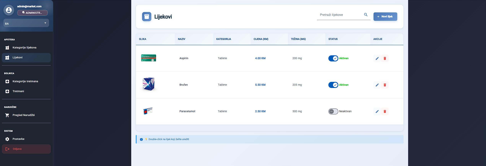
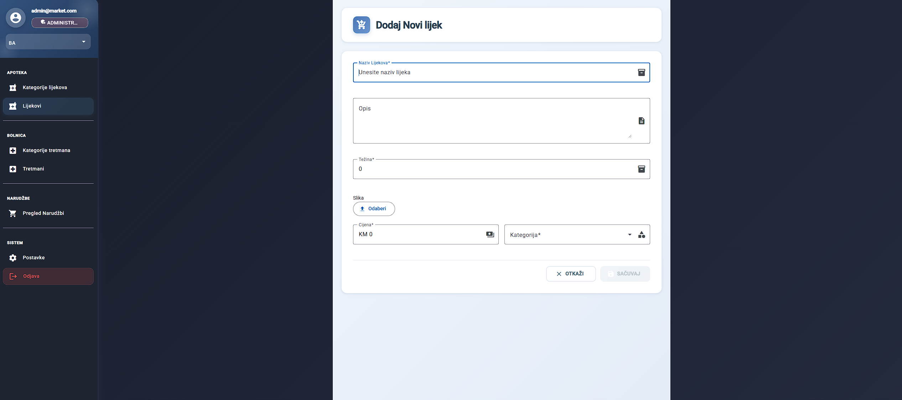
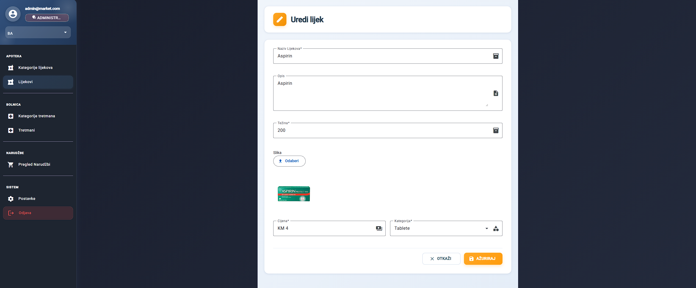
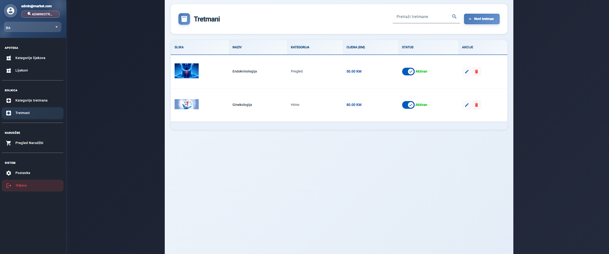
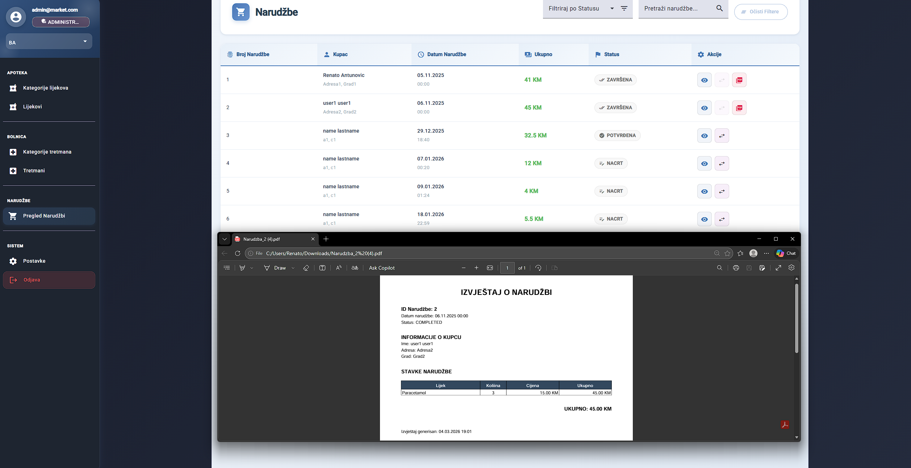
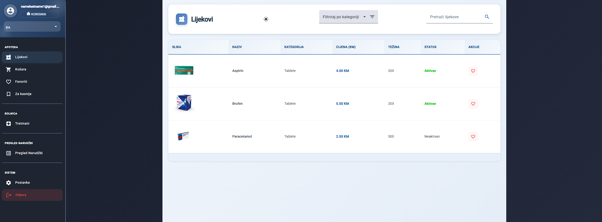
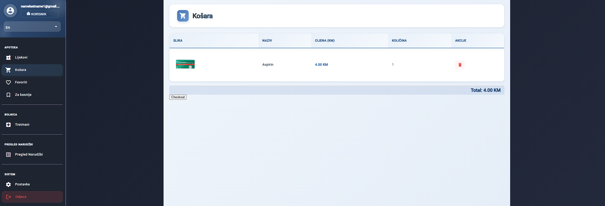
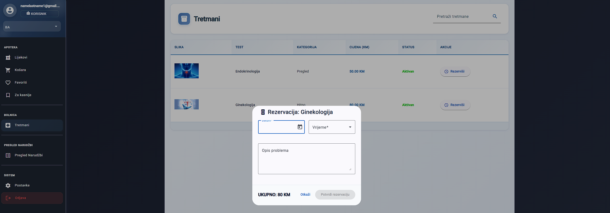

# MediCare (Backend + Frontend)

MediCare is a **full-stack** healtcare managment project consisting of:

- **Backend:** ASP.NET Core Web API (.NET 8)
- **Frontend:** Angular application

The goal of the project is to practice building a real-world style application (API + client) with layered architecture, authentication, CRUD modules and integrations (Swagger, logging, optional Elasticsearch.

> ⚠️ **Project status:** This project is still **in development**. Some modules are functional, while other parts are incomplete or planned.

## Tech Stack

### Backend
- C#
- ASP.NET Core (.NET 8)
- Entity Framework Core
- Swagger (OpenAPI)
- Serilog (logging)
- Elasticsearch (optional module) (you can enable elasticsearch by removing comment lines on Program.cs that are related to it, you need to have running elasticsearch 8.9.3 version before starting the backend)

### Frontend
- Angular
- Node.js + npm
- Proxy configuration to backend API

---
## FEATURES

Authentication
- User login and authentication endpoints

Medicines
- Retrieve medicine data
- Medicine categories

Treatments
- Retrieve treatments
- Treatment categories

Cart
- Add medicines to cart
- Manage user cart

Favourites
- Save favourite medicines

For Later
- Save medicines for later purchase

Orders
- Create and manage user orders

Reservations
- Reserve medicines

Search
- Search functionality using Elasticsearch (optional module)

Sync
- Synchronization endpoints for updating search indexes

API Testing
- Swagger UI for testing API endpoints

## Requirements

### Backend
- **.NET 8 SDK**
- **Visual Studio 2022** (recommended)

Download .NET: https://dotnet.microsoft.com/en-us/download

### Frontend
- **Node.js (LTS recommended)**
- npm (comes with Node.js)

---

## How to run (Backend)

### Option A — Visual Studio
1. Open solution:
   - `MediCare/MediCare/MediCare.Backend/MediCare.Backend.sln`
2. Set `MediCare.API` as Startup Project
3. Run with **F5**

Backend will start on:
- `https://localhost:7260`
- `http://localhost:5177`

### Option B — Terminal
From the backend API folder:

bash
cd MediCare/MediCare/MediCare.Backend/MediCare.API
dotnet restore
dotnet run

## How to run (Frontend)

1. Navigate to frontend folder:

cd MediCare/MediCare/MediCare.Frontend/rs1-frontend-2025-26

2. Install dependencies:

npm install

3. Start Angular development server:

npm start

Frontend will run on:

http://localhost:4200

The frontend uses a proxy configuration that forwards API requests to the backend running on:

https://localhost:7260

So the correct order is:

1) Start backend  
2) Start frontend
cd MediCare/MediCare/MediCare.Backend/MediCare.API
dotnet restore
dotnet run

## Screenshots of the application

